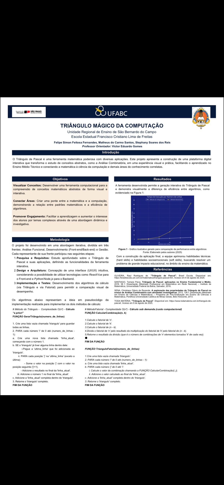

# 📐 Triângulo Mágico da Computação

<p align="left">
  
  
  
  
  
</p>

---

## 📌 Visão Geral

Projeto acadêmico apresentado em **06/10/2025 na UFABC**, como trabalho final do curso técnico integrado ao Ensino Médio na **Escola Estadual Francisco Cristiano Lima de Freitas**, Unidade Regional de Ensino de São Bernardo do Campo.

> 🏆 **TCC reconhecido como vencedor na área de Ciências Exatas entre os trabalhos avaliados.**

O projeto transforma o estudo do **Triângulo de Pascal** em uma experiência visual e interativa, conectando a matemática à ciência da computação através de algoritmos, Análise Combinatória e comparação de eficiência.

---

## 🎯 Objetivos

- **Visualizar Conceitos:** Desenvolver uma ferramenta computacional para a compreensão de conceitos matemáticos abstratos de forma visual e interativa
- **Conectar Áreas:** Criar uma ponte entre a matemática e a computação, demonstrando a relação entre padrões matemáticos e eficiência de algoritmos
- **Promover Engajamento:** Facilitar a aprendizagem e aumentar o interesse dos alunos em temas complexos através de uma abordagem dinâmica e investigativa

---

## 👥 Autores

| Nome | Papel |
|---|---|
| **Felipe Simon Feitosa Fernandes** | Desenvolvimento |
| **Matheus do Carmo Santos** | Desenvolvimento |
| **Stephany Soares dos Reis** | Desenvolvimento |
| **Prof. Victor Eduardo Gomes** | Orientador |

---

## 🛠 Tecnologias Utilizadas

| Tecnologia | Uso |
|---|---|
| **Python** | Implementação dos algoritmos de cálculo |
| **HTML5 / CSS3** | Interface visual interativa (Front-end) |
| **JavaScript** | Lógica de interação e renderização |
| **Node.js** | Back-end (considerado na arquitetura) |

---

## 🔎 Metodologia

O projeto foi desenvolvido em três frentes:

1. **Pesquisa e Requisitos** — Estudo aprofundado sobre o Triângulo de Pascal e suas aplicações, definindo as funcionalidades da ferramenta interativa
2. **Design e Arquitetura** — Concepção de uma interface UI/UX intuitiva
3. **Implementação e Testes** — Desenvolvimento dos algoritmos de cálculo via Triângulo e via Fatorial, para comparar a eficiência visualmente

### Algoritmos Implementados

**Método 1 — Triângulo** `O(n²)` — Cálculo *a priori*
```python
def GerarTriangulo(numero_de_linhas):
    triangulo = []
    for i in range(numero_de_linhas):
        linha_atual = [1] * (i + 1)
        for j in range(1, i):
            linha_atual[j] = triangulo[i-1][j-1] + triangulo[i-1][j]
        triangulo.append(linha_atual)
    return triangulo
```

**Método 2 — Fatorial** `O(n² · k)` — Cálculo *sob demanda*
```python
def CalcularCombinacao(n, k):
    return fatorial(n) // (fatorial(k) * fatorial(n - k))
```

---

## 📈 Principais Resultados

| Método | Complexidade | Desempenho |
|---|---|---|
| Triângulo (iterativo) | O(n²) | Mais rápido para grandes entradas |
| Fatorial (combinatório) | O(n² · k) | Mais lento, porém mais didático |

---

## 📷 Capturas de Tela

### Banner Científico — UFABC



---

## 📝 Conclusões

- O **método iterativo** é significativamente mais eficiente que o método fatorial para grandes entradas
- A plataforma digital criada torna conceitos abstratos de Análise Combinatória acessíveis e visualmente compreensíveis
- O projeto conectou com sucesso a matemática à ciência da computação no ambiente escolar
- 🏆 **TCC vencedor na área de Ciências Exatas** — UFABC, outubro de 2025

> *"Quando a matemática encontra aplicação por meio de soluções de sistemas, o resultado se aproxima do ideal, apresentando respostas não pela força bruta, mas por meio de métodos matemáticos."*

---

## 👨‍💻 Autor Principal

**Felipe Simon**
- 🎓 Ciência de Dados — FATEC
- 📍 São Bernardo do Campo, SP
- 💼 [LinkedIn](https://www.linkedin.com/in/felipe-simon-83ba10352)
- 📧 simonhot.com@gmail.com

---

<p align="left">
  
  
  
</p>
